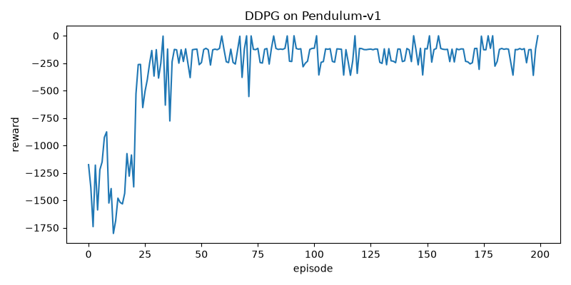

# DDPG Pendulum

A from-scratch PyTorch implementation of **Deep Deterministic Policy
Gradient** (DDPG), trained to swing up and balance the classic
[`Pendulum-v1`](https://gymnasium.farama.org/environments/classic_control/pendulum/)
environment from Gymnasium.

<video src="assets/videos/ddpg-pendulum-episode-0.mp4" controls width="360"></video>

*Trained agent swinging up and balancing the pendulum (episode reward: -125).*

## What's here

- [`src/ddpg`](src/ddpg) — the algorithm itself: replay buffer, Ornstein-Uhlenbeck
  exploration noise, actor/critic networks, and the `DDPGAgent` that ties them
  together.
- [`scripts/train.py`](scripts/train.py) — trains an agent and saves a checkpoint
  plus a reward curve.
- [`scripts/record_demo.py`](scripts/record_demo.py) — loads a checkpoint and
  records an evaluation episode to video.
- [`docs/DDPG.md`](docs/DDPG.md) — a self-contained explainer of the RL theory
  behind DDPG (MDPs, actor-critic, deterministic policy gradient, replay
  buffers, target networks, exploration noise), plus a concrete write-up of
  the four bugs that stopped an earlier version of this implementation from
  converging and how each was fixed.

## Quickstart

```bash
pip install -r requirements.txt

# a trained checkpoint is already included at checkpoints/ddpg_pendulum.pt,
# so you can jump straight to recording a demo:
python scripts/record_demo.py

# or train a fresh one from scratch (~13 minutes on CPU for 40k env steps)
python scripts/train.py
```

Both scripts are configurable from the command line — see `--help` for the
full list of hyperparameters (`gamma`, `tau`, learning rates, buffer size,
noise parameters, etc.).

## Results



Over 200 episodes (40k environment steps), the agent goes from a random
policy that just drops the pendulum (reward around -1300 to -1600 per
episode) to a stable swing-up and balance (reward around -110 to -200 per
episode — Pendulum-v1 is considered solved in that range).

## Background

DDPG ([Lillicrap et al., 2015](https://arxiv.org/abs/1509.02971)) is an
actor-critic, off-policy algorithm for continuous action spaces — exactly
what's needed here, since the pendulum is controlled by a continuous torque
in `[-2, 2]` rather than a discrete set of moves. See
[`docs/DDPG.md`](docs/DDPG.md) for the full explanation.

---

## Learning RL through this project

The rest of this README walks through *how* the agent above learned to swing
the pendulum up, using this specific codebase as the running example. It's
meant to be readable without any prior RL background — just enough neural
network familiarity to know what a gradient step is. For the full derivation
with formulas, see [`docs/DDPG.md`](docs/DDPG.md); this section is the
narrative, visual version.

### The setup: what the agent sees and controls

`Pendulum-v1` gives the agent a **state** every timestep — here,
`[cos(θ), sin(θ), θ̇]`, i.e. the pendulum's angle (encoded to avoid the
discontinuity at ±180°) and its angular velocity. In return, the agent
outputs a **continuous action**: a torque between -2 and +2 N·m applied at
the pivot. After each step it gets a **reward** that penalizes being away
from upright, moving fast, and using large torques — so the maximum possible
reward per step is 0 (hanging perfectly still, upright), and a resting
random policy scores around -1000 to -1600 per 200-step episode just by
never getting there.

This is a control problem, not a classification problem: there's no
"correct label" for a state, only a scalar signal (reward) that says how
good the outcome was. That's the core difficulty reinforcement learning is
built to handle — learning a good policy purely from trial, error, and a
reward signal, with no direct supervision on what the right action was.

### Actor-critic, in this codebase

A natural first idea is: learn a function `Q(state, action)` estimating how
much future reward you get from taking `action` in `state`, then just try
every possible action and pick the best `Q`. That works for a handful of
discrete actions (this is what DQN does), but the pendulum's action space is
a continuum — you can't enumerate every torque value between -2 and 2 to
find the max.

DDPG's answer is to train **two networks that specialize**, both defined in
[`src/ddpg/networks.py`](src/ddpg/networks.py):

- The **actor**, `Actor` — a network that maps a state directly to *one*
  action: `action = actor(state)`. No search, no enumeration — it just
  outputs the torque it thinks is best, squashed to `[-2, 2]` with a `tanh`.
- The **critic**, `Critic` — a network that maps a `(state, action)` pair to
  a single number, its estimated Q-value: "if you take this action in this
  state and then follow the actor from then on, here's roughly how much
  total future reward you'll get."

They train each other, in [`DDPGAgent.update()`](src/ddpg/agent.py):

1. **The critic learns from real experience.** It's trained like ordinary
   regression: given a batch of real `(state, action, reward, next_state)`
   transitions pulled from the replay buffer, its prediction
   `Q(state, action)` is pushed towards the observed
   `reward + γ · Q(next_state, actor(next_state))` — "what actually happened,
   plus your own best guess at the value of what comes next." This is a
   standard MSE loss.
2. **The actor learns from the critic, not from the environment.** The actor
   never sees a reward directly. Instead, its loss is simply
   `-critic(state, actor(state))`: adjust the actor's weights to make the
   critic's opinion of its chosen action go up. Since the critic is
   differentiable, this gradient can be backpropagated straight through it
   into the actor — the critic literally tells the actor which direction in
   action-space would have scored better.

So the critic is the only part of the system that ever touches the reward
signal; the actor learns purely by "listening" to an increasingly accurate
critic. This division of labor is why it's called actor-critic, and why it
scales to continuous actions where value-based methods alone get stuck.

### Exploration: how the agent tries anything new

A freshly initialized actor is close to a random function outputting small
values near zero. If you just ran `action = actor(state)` from the start,
you'd get a deterministic, barely-moving policy that never discovers what a
strong torque even does — including the specific, decisive push needed to
swing the pendulum from hanging straight down up to vertical.

<video src="assets/videos/ddpg-pendulum-exploration-episode-0.mp4" controls width="360"></video>

*Purely exploratory behavior at the very start of training (reward: -886).
This is a freshly initialized, untrained agent taking randomly sampled
torques instead of trusting its own (still meaningless) output — the
"warm-up phase" described below. Compare this random flailing to the
smooth, deliberate swing-up in the video at the top of this page, produced
by the same agent 40,000 environment steps later.*

Two mechanisms generate this exploration, both in
[`DDPGAgent.select_action()`](src/ddpg/agent.py):

- **A warm-up of pure random actions.** For the first `initial_random_steps`
  environment steps (2,000 by default — 10 episodes' worth), the agent
  ignores its own actor entirely and samples actions uniformly from
  `[-2, 2]`. This is what the exploration video above shows. It's a blunt
  tool, but it's what actually gets torques strong enough to swing the
  pendulum past horizontal into the replay buffer at all — without at least
  one such transition recorded, the critic has nothing to learn "swinging up
  is good" from, since it can only generalize from what it's seen.
- **Ornstein-Uhlenbeck (OU) noise added on top of the actor**, after warm-up:
  `action = actor(state) + noise`, implemented in
  [`src/ddpg/noise.py`](src/ddpg/noise.py). Unlike independent Gaussian
  noise at every step (which tends to average itself back to zero over a few
  steps), OU noise is *temporally correlated* — a random push at step `t`
  keeps nudging in roughly the same direction for the next several steps.
  For a system you control with torque, a single independent random kick
  rarely builds up enough momentum to matter, but a short correlated burst
  does — so this noise model explores in a way that's actually compatible
  with the pendulum's physics.

### Learning: from flailing to swing-up

Every transition the agent experiences — whether from random warm-up
actions, noisy actor actions, or (during evaluation) the clean actor output
— gets stored in the [`ReplayBuffer`](src/ddpg/replay_buffer.py). Training
doesn't happen on the live trajectory; instead, every step, a random batch of
128 past transitions is sampled from the buffer (which can hold up to
100,000) and used for one gradient update of the critic, then the actor, as
described above.

Two details make this loop stable instead of diverging:

- **Random sampling breaks correlation.** Consecutive frames of a rollout
  are nearly identical (the pendulum barely moves in one timestep), which
  would badly bias a gradient step if trained on directly. Sampling a random
  batch from a large buffer approximates the i.i.d. data real gradient-based
  optimization expects.
- **Target networks stop the critic from chasing a moving target.** The
  critic's own training target — `reward + γ · Q(next_state, actor(next_state))`
  — is computed using slowly-updated *copies* of the actor and critic
  (`actor_target`, `critic_target`), not the networks currently being
  trained. If the target moved exactly in lockstep with the network learning
  from it, training would tend to oscillate or diverge, the same failure
  mode DQN was designed to avoid. Here the copies track the real networks
  with a small update fraction `τ = 0.005` per step, so the target drifts
  smoothly instead of jumping.

Put together step by step, over an episode, then hundreds of episodes:

1. Early on (steps 0–2,000): pure random torques, reward around -900 to
   -1600 per episode. The buffer fills with everything from "did nothing"
   to "swung wildly."
2. The critic starts correctly labeling *some* of those random transitions
   as better than others — e.g. it learns that states/actions close to
   upright and slow are worth more than states near the bottom moving fast.
3. The actor, chasing the critic's gradient, starts pointing its output
   toward the actions the critic currently rates highest — which pulls
   behavior away from pure noise and toward something that looks like a
   strategy.
4. Because OU noise is still layered on top of the actor after warm-up, the
   agent keeps trying variations near what it currently believes is good,
   letting the critic refine its estimate further — this is the
   exploration/exploitation loop running continuously.
5. By ~25-30 episodes in, this feedback loop (see
   [`assets/training_curve.png`](assets/training_curve.png) for the actual
   curve) sharply pulls the average reward from around -1500 up toward a
   noisy plateau, and by 200 episodes the agent reliably swings up and
   balances, scoring around -110 to -200 — the video at the top of this
   README is one such evaluation episode, run with noise turned off
   (`explore=False`) so it shows the actor's own learned behavior with
   nothing added.

### Why this originally didn't work

An earlier hand-written version of this same algorithm — same actor/critic
architecture, same replay buffer, even an unused `OUNoise` class already
sitting in the code — plateaued at a reward around -500 and never produced a
real swing-up. It turned out to be missing exactly the exploration
machinery described above: no warm-up phase, and the noise it did use was
uncorrelated *and* had a sign bug that biased it to always push in one
direction. See [`docs/DDPG.md`](docs/DDPG.md#5-what-was-wrong-with-the-first-from-scratch-attempt)
for the full list of four bugs and fixes — it's a concrete illustration that
in DDPG, getting the exploration and stabilization details right matters as
much as getting the core actor-critic math right.
