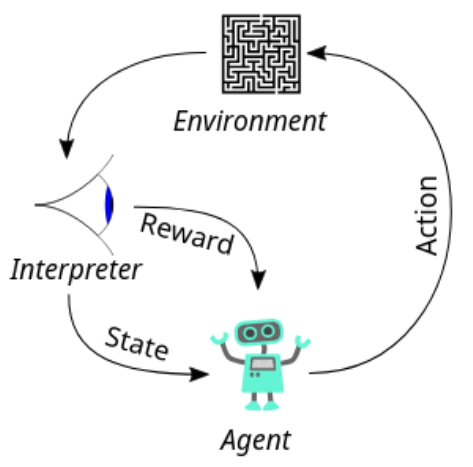
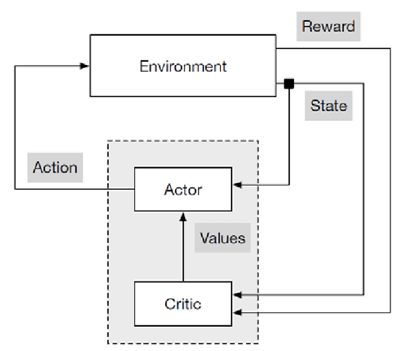

# DDPG Pendulum

A from-scratch PyTorch implementation of **Deep Deterministic Policy
Gradient** (DDPG), trained to swing up and balance the classic
[`Pendulum-v1`](https://gymnasium.farama.org/environments/classic_control/pendulum/)
environment from Gymnasium.


*Trained agent swinging up and balancing the pendulum (episode reward: -125).
Full-quality version: [`assets/videos/ddpg-pendulum-episode-0.mp4`](assets/videos/ddpg-pendulum-episode-0.mp4).*

## What's here

- [`src/ddpg`](src/ddpg) — the algorithm itself: replay buffer, Ornstein-Uhlenbeck
  exploration noise, actor/critic networks, and the `DDPGAgent` that ties them
  together.
- [`scripts/train.py`](scripts/train.py) — trains an agent and saves a checkpoint
  plus a reward curve.
- [`scripts/record_demo.py`](scripts/record_demo.py) — loads a checkpoint and
  records an evaluation episode to video.
- [`docs/DDPG.md`](docs/DDPG.md) — a self-contained explainer of the RL theory
  behind DDPG (MDPs, actor-critic, deterministic policy gradient, replay
  buffers, target networks, exploration noise), plus a concrete write-up of
  the four bugs that stopped an earlier version of this implementation from
  converging and how each was fixed.

## Quickstart

```bash
pip install -r requirements.txt

# a trained checkpoint is already included at checkpoints/ddpg_pendulum.pt,
# so you can jump straight to recording a demo:
python scripts/record_demo.py

# or train a fresh one from scratch (~13 minutes on CPU for 40k env steps)
python scripts/train.py
```

Both scripts are configurable from the command line — see `--help` for the
full list of hyperparameters (`gamma`, `tau`, learning rates, buffer size,
noise parameters, etc.).

## Results


Over 200 episodes (40k environment steps), the agent goes from a random
policy that just drops the pendulum (reward around -1300 to -1600 per
episode) to a stable swing-up and balance (reward around -110 to -200 per
episode — Pendulum-v1 is considered solved in that range).

## Background

DDPG ([Lillicrap et al., 2015](https://arxiv.org/abs/1509.02971)) is an
actor-critic, off-policy algorithm for continuous action spaces — exactly
what's needed here, since the pendulum is controlled by a continuous torque
in `[-2, 2]` rather than a discrete set of moves. See
[`docs/DDPG.md`](docs/DDPG.md) for the full explanation.

---

## Learning RL through this project

A short version of the theory, using this codebase as the example. For
formulas and derivations, see [`docs/DDPG.md`](docs/DDPG.md).

**The RL loop.** Every step, the agent observes a **state** (pendulum angle
+ angular velocity), picks an **action** (a torque in `[-2, 2]`), and gets a
**reward** (highest when upright, still, and using little torque). There's
no "correct" action to imitate — only this scalar feedback to learn from.



**Actor-critic.** The action space is continuous, so the agent can't just
enumerate every torque and pick the best one. DDPG instead trains two
networks ([`src/ddpg/networks.py`](src/ddpg/networks.py)) that specialize:



- **Critic** `Q(state, action)` — trained like ordinary regression, from real
  transitions in the replay buffer, to predict future reward.
- **Actor** `action = π(state)` — trained to maximize the critic's output,
  by backpropagating the critic's gradient straight into the actor. It never
  sees the reward directly, only the critic's opinion of its choices.

This split is what [`DDPGAgent.update()`](src/ddpg/agent.py) implements
every training step.

**Exploration.** A fresh actor outputs near-zero, meaningless actions, so
early on the agent needs to act mostly at random to discover what strong
torques even do:


*Untrained agent taking random torques during the warm-up phase (reward:
-886) — compare to the trained agent above, same agent, 40k steps later.*

Two mechanisms drive this, in
[`DDPGAgent.select_action()`](src/ddpg/agent.py): a **warm-up** of pure
random actions for the first 2,000 steps (what the clip above shows), then
**Ornstein-Uhlenbeck noise** added on top of the actor's own action — noise
that stays correlated across steps instead of averaging to zero, which
matters for building up torque-driven momentum.

**Putting it together.** Every transition (random, noisy, or clean) is
stored in the [`ReplayBuffer`](src/ddpg/replay_buffer.py). Each step, a
random batch is sampled from it to update the critic (towards the real
reward plus its own bootstrapped estimate) and then the actor (towards
whatever the critic currently rates highest) — using **target networks**
(slow-tracking copies of both, `τ = 0.005`) so the critic isn't chasing a
target that moves as fast as it's learning. Repeated over thousands of
steps, this pulls behavior from random flailing to the swing-up-and-balance
policy in [`assets/training_curve.png`](assets/training_curve.png).

An earlier hand-written version of this same algorithm was missing exactly
this exploration machinery (no warm-up, uncorrelated *and* biased noise) and
plateaued at reward -500 without ever swinging up — see
[`docs/DDPG.md`](docs/DDPG.md#5-what-was-wrong-with-the-first-from-scratch-attempt)
for the four concrete bugs and fixes.
